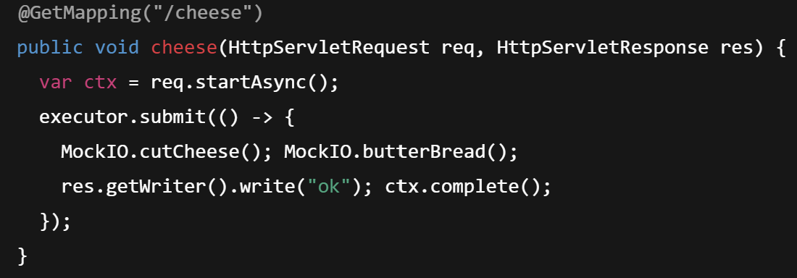
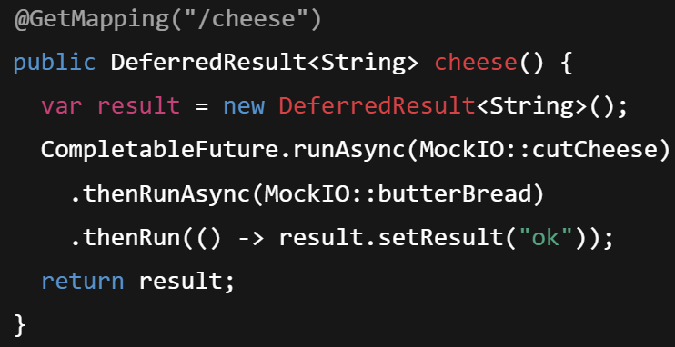
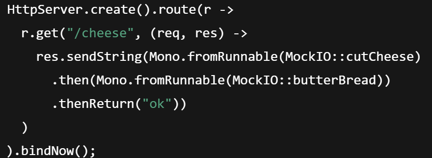
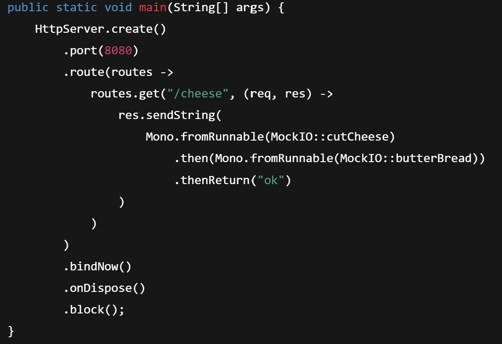

# Threading workshop project    
This is a simple project to demonstrate the use of threading in Java.
To run your gatling load tests go to you intellij terminal and run the following command:
```bash 
mvn gatling:test
```

### ✅ Option 1: `Servlet Async` + `Virtual Threads`

## Free Tomcat thread, delegate to a virtual thread.


✅ Option 2: `DeferredResult` + `CompletableFuture`

Clean async chaining with virtual thread support.


✅ Option 3: Use `HttpServer.create()` (Reactor Netty)



✅ Option 4: Switch to WebFlux